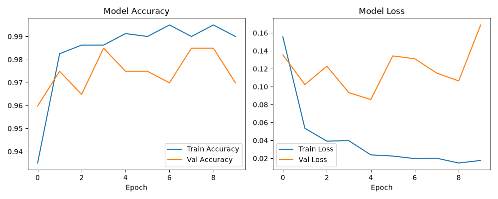

# DisasterShield — SCAI 2026

**AI-Powered Multi-Hazard Early Warning System with Edge Intelligence & Sensor Fusion**

**SCAI 2026** | **Track 1: Smart Sensing & Intelligent Electronic Systems**
**IEEE Student Branch, SVNIT Surat**

---

## Problem Statement

Climate change is increasing the frequency of natural disasters — floods, wildfires, droughts — across India, causing heavy loss of life, crops, and property. Existing early-warning systems are often expensive, centralized, and too slow to give localized, real-time alerts to the communities that need them most.

## Solution

DisasterShield is a low-cost, AI-based multi-hazard early warning system combining:
- Real-time fire/smoke detection using a trained deep learning model
- Multi-sensor data fusion for temperature, smoke, rain, and soil moisture trends
- A live web dashboard for monitoring and risk-level alerts

## Tech Stack

- **Language:** Python 3.13
- **Computer Vision:** OpenCV
- **AI/ML:** MobileNetV2 (transfer learning), trained with TensorFlow/Keras, converted to TensorFlow Lite for edge inference
- **Dashboard:** Flask, live MJPEG video streaming
- **Sensor Fusion:** Custom rule-based risk engine combining vision confidence with simulated sensor readings

## Dataset

- **Fire Dataset** (Kaggle, phylake1337/fire-dataset) — 755 fire images, 244 non-fire images
- Images resized to 160x160, augmented with rotation/zoom/flip during training

## Model & Results

- Base: MobileNetV2 (ImageNet pretrained), frozen backbone + custom classification head
- Trained for 10 epochs on the fire dataset
- **Training accuracy: 99.87%**
- **Validation accuracy: 97.99%**
- Exported to TensorFlow Lite (`models/fire_smoke_model.tflite`, ~9.2 MB) for lightweight inference



## Current Status (as of July 2026)

- [x] Environment setup and repo structure
- [x] Live camera capture pipeline (OpenCV)
- [x] MobileNetV2 model trained and validated (97.99% val accuracy)
- [x] TFLite conversion for edge-ready inference
- [x] Flask dashboard with live video feed and risk overlay
- [x] Sensor simulation module (temperature, humidity, smoke, rain, soil moisture)
- [x] Fusion logic combining AI confidence + sensor trends into a risk level (Low/Medium/High)
- [ ] Real hardware sensor integration (Raspberry Pi + physical sensors) — planned next
- [ ] Remote sensing / NDVI-based wide-area risk mapping — planned next

## Project Structure
## How to Run

```bash
python -m venv venv
venv\Scripts\activate
pip install -r requirements.txt
python app.py
```
Then open `http://127.0.0.1:5000` in a browser.

## Support Requested

- Guidance on improving model robustness with more diverse non-fire training data
- Suggestions for real sensor hardware suited for a student budget
- Feedback on the risk-fusion logic for flood/drought scenarios

## Why This Matters

DisasterShield aligns with SCAI 2026's theme of Connected Intelligence — combining smart sensing, trained AI, and sensor fusion to build a system with real, localized societal impact for disaster response in vulnerable communities.

---

**Solo Developer:** Harsh C. Parmar
**Submitted for:** SCAI 2026 — Project Challenge & Technical Showcase, IEEE SVNIT Surat


## Model Performance & Results

- **Validation Accuracy:** 96.98% - 97.99% (multiple training runs)
- **Training Accuracy:** ~99%
- **Model:** MobileNetV2 (Transfer Learning) + Custom Classification Head
- **Exported to:** TensorFlow Lite (`models/fire_smoke_model.tflite`) — Edge-ready for Raspberry Pi


**Multi-Hazard Risk Engine** — Camera (AI Vision) + Simulated Sensors (Temperature, Humidity, Smoke, Rain, Soil Moisture) fused into a single risk level.
